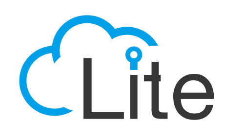

# LiteOS

Huawei **LiteOS** 是华为面向IoT领域，构建的"统一物联网操作系统和中间件软件平台"，以轻量级（内核小于10k）、低功耗（1节5号电池最多可以工作5年），快速启动，互联互通，安全等关键能力，为开发者提供 "一站式" 完整软件平台，有效降低开发门槛、缩短开发周期。

Huawei LiteOS 目前主要应用于智能家居、穿戴式、车联网、智能抄表、工业互联网等 IoT 领域的智能硬件上。

**Lite OS** 是：目前世界上最轻量级的物联网操作系统，其系统 **体积轻巧到10KB级**，具备零配置、自组网、跨平台的能力，可广泛应用于智能家居、穿戴式、车联网、工业等领域。

Lite OS未来会如何目前无法预测。据了解，英特尔在会上展示了AR515系列和AR160-M系列两款物联网网关产品。Lite OS可以将不同的行业客户聚集起来，形成“互通有无”的生态链系统。

> [Huawei LiteOS](http://www.huawei.com/minisite/iot/cn/liteos.html)
