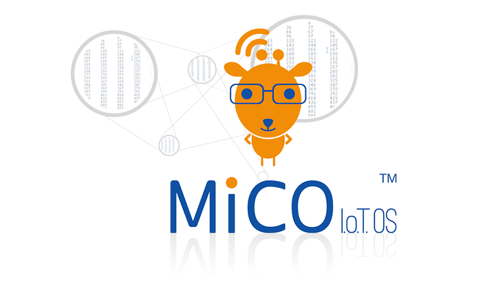

# MiCO

**MICO** 的全称是：Micro-controller based Internet Connectivity Operating system。 是基于微控制器的互联网接入操作系统。 开发者可以在各种微控制器平台上基于MICO来设计接入互联网的创新智能产品，实现人，物互联。

## 实时多线程的rtos内核，内涵丰富！

微控制器是和传统PC、手机平台完全不同的硬件平台，它集成度高、响应快、功耗低、控制功能丰富，但是它的处理能力和资源却相对较弱。MICO系统中集成的深度优化的RTOS内核，在保证微控制器平台传统优势的情况下，实现了资源高效合理的利用。

## 微控制器平台的多面手

微控制领域的处理器品类众多，功能丰富多彩，在不同的应用领域各领风骚。MICO支持大部分常用的微控制器平台，如ST，ATMEL，FREESCALE，NXP，MICROCHIP等等，并且有针对性优化。开发者可以针对应用方案和喜好自由选择。

## 互联网接入一站式解决方案

智能硬件的互联网接入已经超过了网络通讯的技术范畴，更是智能硬件与用户交互的核心体验。MICO内置完整广泛应用的成熟解决方案，包括简易的交互式网络配置，智能硬件的初次设置，超快速的无线网络接入，服务的发现，身份的认证，数据安全

## 应用程序框架为您的开发提速

MICO中包含的应用程序框架包含了云计算平台和智能设备通讯协议，如阿里云服务，Apple HomeKit协议等，也包含了常见典型应用的应用示例，和移动APP SDK，帮助开发者快速建立应用原型，加快开发进度，缩短产品上市时间。

## 高能效助力绿色环保生活

MICO保持了微控制器一贯的低功耗特性，更包含先进的动态功耗管理技术，并且针对各种微控制器进行优化，在不同应用场景下自动使用合适的功耗控制策略，基于MICO的智能硬件将体现我们IT工程师们对环境的社会责任。

## 安全，稳定，可靠

相比普通的应用软件，智能硬件中的软件系统要更加稳定，可靠。同时，作为独立的互联网终端，智能硬件是对用户隐私保护重要的一环。MICO系统中包含了完整的网络安全算法和协议，保证数据安全的传播。同时，经历10年国内外800多家客户的测试和验证，是一个已经被证明了的稳定，可靠的物联网操作系统。

> [Learn more.](http://www.mxchip.com/product/mico])
