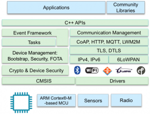

#mbed OS

**ARM® mbed™ 操作系统** 是一种专为物联网 (**IoT**) 中的“物体”设计的开源嵌入式操作系统。该操作系统包含您基于 **ARM Cortex-M** 微控制器开发连接产品所必需的全部功能，非常适合涉及智能城市、智能家庭和穿戴式设备等领域的应用程序。

mbed 操作系统可提供核心操作系统、稳健的安全基础、基于标准的通信功能以及针对传感器、I/O 设备和连接性开发的驱动程序，能够加快从初始创意到部署产品的这一进程。mbed 操作系统是模块化的可配置软件堆栈，有助于您轻松针对目标开发设备对其进行自定义，以及通过排除不必要的软件组件降低内存要求。

mbed 操作系统在微控制器上属于 mbed IoT 设备平台的客户端部分，专为与 mbed 设备连接器、mbed 设备服务器和 mbed 客户端配合使用而设计。 总的来说，这一平台使您能够提供全面的 IoT 解决方案。

## 核心操作系统原则

早在嵌入式设备连接到巨大网络之前，传统嵌入式操作系统就已设计出来。 因此，这类操作系统无法解决针对 IoT 设备的新要求。 相比而言，mbed 操作系统是专为 IoT 设备而特别构建的。 我们的设计围绕着 IoT 设备的五个核心原则：安全性、连接性、可管理性、效率和生产率。

默认情况下，mbed 操作系统是事件驱动的单线程架构，而非多线程（实时操作系统）环境。 这确保了它可以扩展到尺寸最小、成本最低且功耗最低的 IoT 设备。 该操作系统包含事件驱动的、可向用户和系统事件提供服务的简单调度程序。

对于大多数 IoT 应用程序，事件驱动的范例是最合适不过的。 但是，对于那些需要多线程功能的应用程序，我们计划于 2016 年（即在将该操作系统与我们的安全和电源管理组件相集成后）再次推出该操作系统。

微控制器和 IoT 设备的硬件功能和要求有所不同。mbed 操作系统包含低级硬件抽象层 (HAL) 以及适用于常见硬件外设（例如 SPI 和 I2C 端口、GPIO 针和计时器）的高级抽象驱动程序。 此外，mbed 操作系统中的硬件抽象层和驱动程序还为电源管理提供了深层集成支持，加上调度程序中的能效认知功能，可帮助 mbed 操作系统应对高要求应用程序（在这些应用程序中，能效对操作至关重要）。

## 安全性

安全性往往事后才会想到，是一道极具挑战性的难题 - 如果没有及时采取措施，您将需要花巨资召回产品。 在嵌入式设备连接到网络、受托管理宝贵数据或私人数据以及部署到具有长服务寿命要求的应用程序中时，安全性是一个关键因素，应着重考虑。 ARM mbed IoT 设备平台在多个层级解决了安全问题：

- *设备本身。*
- *通信。*
- *设备从生产到部署、调试、服务再到最终退休的整个生命周期。*

mbed 操作系统的设备安全架构的基础是 mbed 操作系统 uVisor [链接]，它利用我们对 Cortex-M 架构及其功能的深入了解，在微控制器中创建和强制实施独立的安全域。 通过使用 uVisor 分隔系统的敏感部分，mbed 操作系统解决了安全难题，不仅保护了启动流程和调试会话，确保了固件更新的安全安装，还阻止了恶意或错误代码升级权限和泄露秘密。 目前，mbed 操作系统 uVisor 需要使用带内存保护单元 (MPU) 的 Cortex-M3 或 M4；我们将继续添加对其他 Cortex-M 内核的支持。

mbed 操作系统还会利用 mbed TLS [链接] 提供最先进的通信安全功能。 首先也是最重要的一点是，mbed TLS（及相关的 mbed 操作系统）支持传输层安全 (TLS) 协议。 TLS 以及相关的 Datagram TLS (DTLS) 协议是标准协议，用于保护 Internet 通信安全，已被证实能够防止窃听、纂改和伪造消息。此外，mbed TLS 还包括一系列常用加密原语、证书处理及其他加密功能的参考质量软件实施。

ARM 最近收购了 Sansa Security，这使得我们可以在 mbed 操作系统的后续版本中加入成熟的、功能丰富的轻量级生命周期安全功能。

## 连接性和联网

IoT 中的通信和联网技术因 IoT 应用程序本身不同而各异，没有一种技术适用于所有应用程序。 我们的目标是稳健、高效且安全地实施对用户最重要的技术和协议，同时让那些要求更专业的技术和协议在 mbed 操作系统上有所区分。

我们在 mbed 操作系统中支持的核心连接性 [链接] 技术包括：

- *以太网。*
- *WiFi。*
- *IPv6 和 6LoWPAN。*
- *线程。*
- *Bluetooth Low Energy (BLE)。*

ARM 主动帮助标准机构开发适用于 IoT 的协议和标准并确保现有行业标准在 IoT 环境中运作良好。 我们已对线程、CoAP 和 LWM2M 以及其他技术进行标准化，并且在 mbed 操作系统中进行实施时将应用这一知识。

## 可管理性

现场管理设备的能力是实现大规模部署的关键，同时也是 mbed IoT 设备平台的核心部分，支持：

- *OMA 轻量级 M2M (LWM2M) - 用于监控和管理嵌入式设备的常用协议。 我们在 mbed 操作系统、mbed 客户端和 mbed 设备服务器中为其提供支持。*
- *受限应用程序协议 (CoAP) - 专为解决使用高效数据共享机制和 RESTful 通信跨受限网络进行通信的难题而设计。 我们在 mbed 操作系统和 mbed 客户端中为其提供支持。*

通过在 mbed 客户端中为这些协议提供支持，您可以在其他嵌入式操作系统和 Linux 中实施这些协议。

## 后续步骤

mbed 操作系统仍处于开发阶段。

>[参考链接](https://www.mbed.com/zh-cn/development/mbed-os/)
