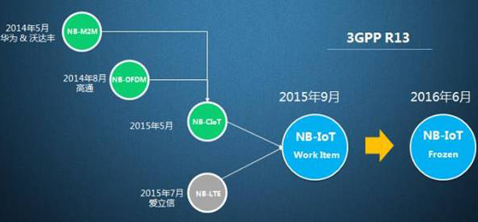

# NB-IoT

基于蜂窝的窄带物联网（**Narrow Band Internet of Things, NB-IoT**）成为万物互联网络的一个重要分支。NB-IoT构建于蜂窝网络，只消耗 **大约180KHz的带宽**，可直接部署于 **GSM网络、UMTS网络或LTE网络**，以降低部署成本、实现平滑升级。

**NB-IoT** 是IoT领域一个新兴的技术，支持低功耗设备在广域网的蜂窝数据连接，也被叫作 **低功耗广域网(LPWA)**。NB-IoT支持待机时间长、对网络连接要求较高设备的高效连接。据说NB-IoT设备电池寿命可以提高至 **至少10年**，同时还能提供非常全面的室内蜂窝数据连接覆盖。

## NB-IoT具备四大特点

- 一是 *广覆盖*，将提供改进的室内覆盖，在同样的频段下，NB-IoT比现有的网络增益20dB，覆盖面积扩大100倍；
- 二是具备 *支撑海量连接* 的能力，NB-IoT一个扇区能够支持10万个连接，支持低延时敏感度、超低的设备成本、低设备功耗和优化的网络架构；
- 三是 *更低功耗*，NB-IoT终端模块的待机时间可长达10年；四是更低的模块成本，企业预期的单个接连模块不超过5美元。

## NB-IOT的概述

对于物联网标准的发展，华为的推进最早。2014年5月，华为提出了窄带技术NB M2M；2015年5月融合NB OFDMA形成了NB-CIOT；7月份，NB-LTE跟NB-CIOT进一步融合形成NB-IOT；预计NB-IOT标准会在3GPP R13出现，并于2016年3月份冻结。

此前，相对于爱立信、诺基亚和英特尔推动的NB-LTE，华为更注重构建NB-CIOT的生态系统，包括高通、沃达丰、德国电信、中国移动、中国联通、Bell等主流运营商、芯片商及设备系统产业链上下游均加入了该阵营。

基于蜂窝的窄带物联网（Narrow Band Internet of Things, NB-IoT）成为万物互联网络的一个重要分支。NB-IoT构建于蜂窝网络，只消耗大约180KHz的带宽，可直接部署于GSM网络、UMTS网络或LTE网络，以降低部署成本、实现平滑升级。

NB-IOT聚焦于低功耗广覆盖（LPWA）物联网（IoT）市场，是一种可在全球范围内广泛应用的新兴技术。具有覆盖广、连接多、速率低、成本低、功耗低、架构优等特点。 NB-IOT使用License频段，可采取带内、保护带或独立载波等三种部署方式，与现有网络共存。

## NB-IOT的前景与优势

移动通信正在从人和人的连接，向人与物以及物与物的连接迈进，万物互联是必然趋势。然而当前的4G网络在物与物连接上能力不足。事实上，相比蓝牙、ZigBee等短距离通信技术，移动蜂窝网络具备广覆盖、可移动以及大连接数等特性，能够带来更加丰富的应用场景，理应成为物联网的主要连接技术。作为LTE的演进型技术，4.5G除了具有高达1Gbps的峰值速率，还意味着基于蜂窝物联网的更多连接数，支持海量M2M连接以及更低时延，将助推高清视频、VoLTE以及物联网等应用快速普及。蜂窝物联网正在开启一个前所未有的广阔市场。

对于电信运营商而言，车联网、智慧医疗、智能家居等物联网应用将产生海量连接，远远超过人与人之间的通信需求。

NB-IoT具备四大特点：一是广覆盖，将提供改进的室内覆盖，在同样的频段下，NB-IoT比现有的网络增益20dB，覆盖面积扩大100倍；二是具备支撑海量连接的能力，**NB-IoT一个扇区能够支持10万个连接**，支持低延时敏感度、超低的设备成本、低设备功耗和优化的网络架构；三是更低功耗，NB-IoT终端模块的待机时间可长达10年；四是更低的模块成本，企业预期的单个接连模块不超过5美元。

NB-IOT聚焦于低功耗广覆盖（LPWA）物联网（IOT）市场，是一种可在全球范围内广泛应用的新兴技术。其具有覆盖广、连接多、速率低、成本低、功耗低、架构优等特点。NB-IOT使用License频段，可采取带内、保护带或独立载波三种部署方式，与现有网络共存。

因为NB-IoT自身具备的低功耗、广覆盖、低成本、大容量等优势，使其可以广泛应用于多种垂直行业，如远程抄表、资产跟踪、智能停车、智慧农业等。3GPP标准的首个版本预计在今年6月发布，到时候将有一批测试网络和小规模商用网络出现。

目前包括我国运营商在内诸多运营商在开展NB-IoT和研究。就NB-IoT的发展现状，余泉详细阐述了三个精彩观点：一是NB-IoT是蜂窝产业应对万物互联的一个重要机会。二是NB-IoT要成功必须要建立开放产业平台。三是2016年是NB-IoT产业非常关键的一年，标准、芯片、网络以及商用应用场景都会走向成熟。

>[参考链接](http://baike.baidu.com/link?url=8xvYRx1meTkc2FGl7f424zf76Asun9u6s26zeZ5KjnifcNUjo2tpL25qIZMo7hhRlPHGbHZQnqr0bB8v_ZuVIK)
