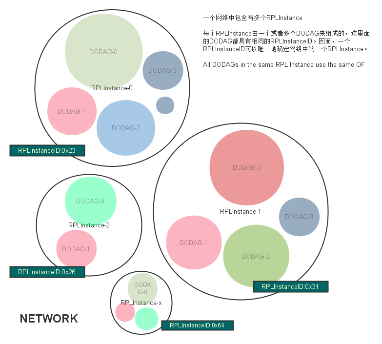
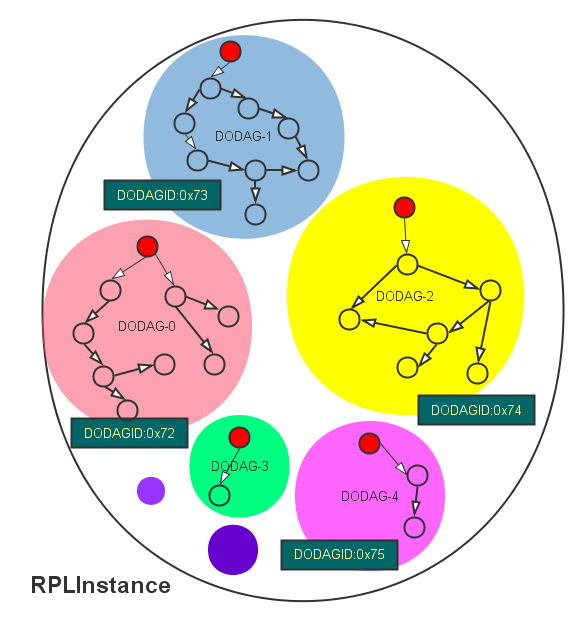
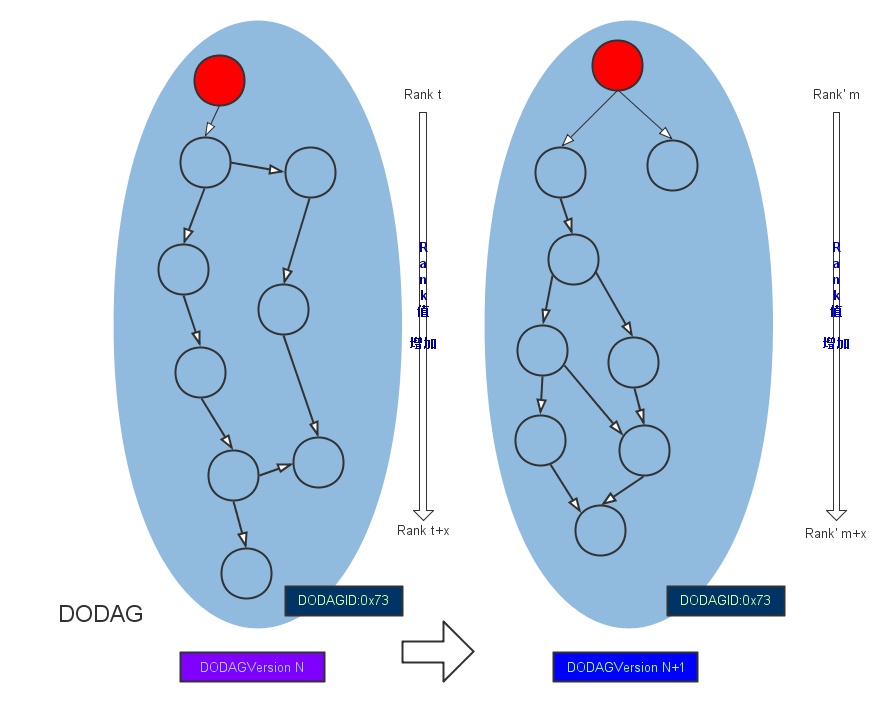

# RPL协议介绍

**RPL** 是IPv6 Routing Protocol for Low-Power and Lossy Networks的简称。

低功耗及有损网络（LLN）是一类内部链接和路由器都受限的网络，该网络下的路由器的处理器功能、内存及系统功耗（电池供电）都可能受到较大的限制，而里面的网络连接也具有高丢包率、低数据传输率及不稳定的特性。组成该网络的节点数量也多种多样，一张网络中可能仅也几个节点，也可能有成千上万个节点。节点间通讯拓扑方式可有三种形式：

- 点到点：网络内节点到节点的通讯；
- 点到多点：LLN网络内一个中心节点到一个设备子网的所有节点通讯；
- 多点到点：LLN网络内一个设备子网内的所有节点到一个中心节点的通讯；

# 1、重要术语

- DAG
- DODAG

Objective Function (OF): An OF defines how routing metrics, optimization objectives, and related functions are used to compute Rank. Furthermore, the OF dictates how parents in the DODAG are selected and, thus, the DODAG formation.目标功能OF：OF定义了路由计量标准、目标路径优化，以及计算Rank值的方式。与此同时，OF还规定了如何确定DODAG中的父节点的方式，即如何构造DODAG。

# 2、RPL简介

## 2.1、拓扑图

本小节描述RPL的基本拓扑形式，以及如何建立这些网络的规则，即建立DODAG的规则。

LLN网络不像我们平常的有线网络那样是点到点传输的，LLN一般没有预先规定好某个发送节点的目标，网络内的节点必须自己去发现其它的节点并按RPL规则建立通信。RPL路由把网络拓扑内所有节点向外的信道汇集到一个或多个指定的出入口（sink）上去，反之外部的信息也从这些出入口（sink）出来分发给网络里面的节点。所以，RPL把整张网络视为一个DAG图（Directed Acyclic Graph），然后再将这个DAG图分割为多个DODAG图，每个DODAG图含有一个根节点（出入口sink，可以接收或发送外网信息）。这些根节点通常会连接到某一主干网上去。

**RPL** 中各元素的关系

1）NETWORK

- 一个网络中会包含有多个RPLInstance，各个RPLInstance具有自己的RPLInstanceID；
- 6lowpan应用的主要问题都集中在RPLInstance及以下的部分，因为RPLIntance的root是有能力连接到主干网络的（这就属于互联网时代的技术了）；

2）RPLInstance

- 一个RPLInstance中含有一个或者多个DODAG，各个DODOAG含有自己的DODAGID；
- 同一个RPLInstance里的所有DODAG共享同一种OF；

3）DODAG

- 每个DODOAG内含有且仅有一个root，其它的都为node；
- 每个node还有一个属性DODAGVersion，当DODAG重构时DODAGVersion会跟着增加，比如节点发生移动、信号强度互相有变化时DODAG会重构拓扑图，从而引发DODAGVersion增加。不过DODAGVersion有的时候并不是因为拓扑图变化了才增加，有其它可能导致它增加的原因；
- DODAG内的所有节点具有自己的Rank值，该值在越接近root的节点处越小，越远离root的节点则越大；
RPLInstance可能有下面的多种组成方式：

- 仅有一个root的单一DODAG形式
  *比如，某个智能家居应用中，最小化的电灯控制系统，仅需要一个DODAG就可以了；*
- 多个DODAG形式（各自有root，不同的DODAGID）
  *比如，在某个多点数据收集应用中，节点间没有办法互相协调所以被迫分割成多个DODAG了，或者仅是为了实现其中某一部分节点能够动态地进入/离开网络而采用了多DODAG的方式；*
- 单一DODAG形式（使用一个主干网上的的一个根节点作为虚拟根节点，用它协调其它DODAG的根，这样该RPLInstance下的所有DODOAG具有相同的DODAGID了）
  *比如，某网络中的多个边界路由器，它们都具有可靠的网络连接，在理论上它们都可以扮演网络里所有DODAG的出入口（sink）功能；*
- 上面几种情况的组合
原文如下：
>A RPL Instance may comprise:
   o  a single DODAG with a single root
      *  For example, a DODAG optimized to minimize latency rooted at a single centralized lighting controller in a Home Automation application.
   o  multiple uncoordinated DODAGs with independent roots (differing DODAGIDs)
      *  For example, multiple data collection points in an urban data collection application that do not have suitable connectivity to coordinate with each other or that use the formation of multiple DODAGs as a means to dynamically and autonomously partition the network.
   o  a single DODAG with a virtual root that coordinates LLN sinks(with the same DODAGID) over a backbone network.
      *  For example, multiple border routers operating with a reliable transit link, e.g., in support of an IPv6 Low-Power Wireless Personal Area Network (6LoWPAN) application, that are capable of acting as logically equivalent interfaces to the sink of the same DODAG.
   o  a combination of the above as suited to some application scenario.

## 2.2、上行路由与构建DODAG

RPL规定从节点到DODOAG的根的路由，应该根据OF算出最优的DODAG来，节点间通过互相传递DIO（DODAG Information Object）信息数据来建立和维护DODAG图。

## 2.3、下行路由

RPL使用DAO（Destination Advertisement Object (DAO)）信息数据来建立下行路由

>[参考链接](http://www.cnblogs.com/tfanalysis/p/3690890.html)
