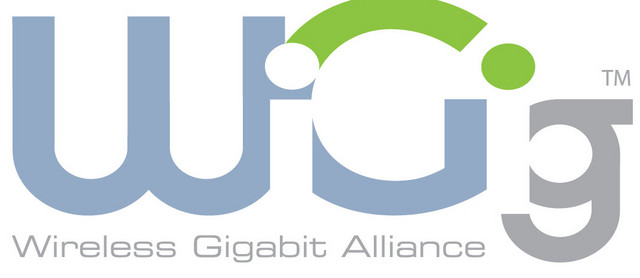

# WiGig

**IEEE 802.11ad** 标准也被称为 **[WiGig](http://baike.baidu.com/link?url=OUP7Wdc61zMlsWlHF2ooSks4lf4qRVMKeE3HKEiTJh0KHaEUesg2MykagtU7ad1AMmbL_uRGLH0trr8DZfssxa)**，通过其名称就能看出其与802.11的渊源。只不过相比我们熟知的802.11n（工作在2.4GHz和5GHz频段）和802.11ac（工作在5GHz频段），802.11ad则是工作在 **60GHz** 频段，且无线传输速率可高达 **7Gbps**！

熟悉802.11ac标注你的朋友知道，通过8x8 MIMO、256 QAM调制和信道绑定4个40 MHz信道，11ac标准的理论无线传输速率同样可达7Gbps；但要知道，11ad达到7Gbps的速度，仅需通过一个空间流、64QAM调制和单个信道即可实现。此外，802.11ad还在容量、功耗和延迟方面有着11ac无法比拟的优势，特别是在延迟方面，其延迟通常仅有10微秒，堪比有线！

然而802.11ad也有自己的“**软肋**”。我们知道，**频段越高，无线穿越物体的能力就越差**，工作在5GHz频段的11ac相比工作在2.4GHz频段的11n已经可以看出差异，因此工作在60GHz频段的11ad，基本上不具备“穿墙”能力。所以说，三频产品(**802.11n/ac + 802.11ad**)成为了无线网络设备下一阶段的理想之选。

最后，我们还要强调一点，**802.11ad并不是终点**，因为工作在5GHz频段，且无线传输速率可达 **10Gbps的802.11ax标准** 已经开始展露头角（IEEE的802.11ax规格制定工作小组已于2014年11月开始着手订定该规格架构，预计2016年7月完成第一版草案，2017年3月完成第二版草案，并于2019年上半年出出版802.ax修定案）。而更加惊人的消息是，我国的华为已经于2014年5月率先发布了业界首款 10G WiFi实验室样机，其最高无线传输速率达到了 **10.53Gbps**，震惊业界。

>[参考链接](http://baike.baidu.com/link?url=OUP7Wdc61zMlsWlHF2ooSks4lf4qRVMKeE3HKEiTJh0KHaEUesg2MykagtU7ad1AMmbL_uRGLH0trr8DZfssxa)
