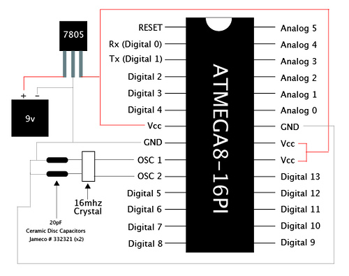
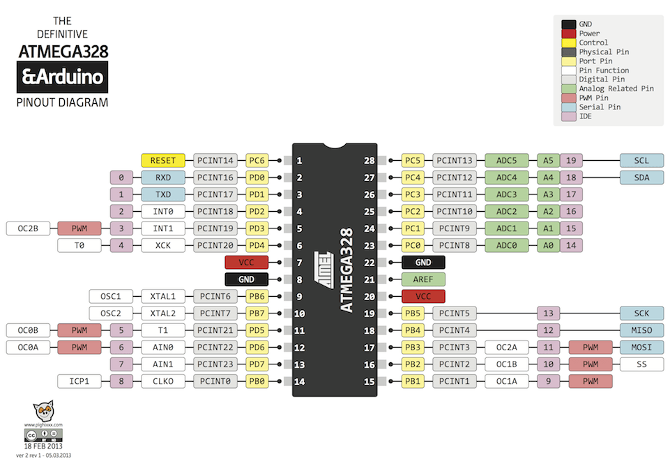
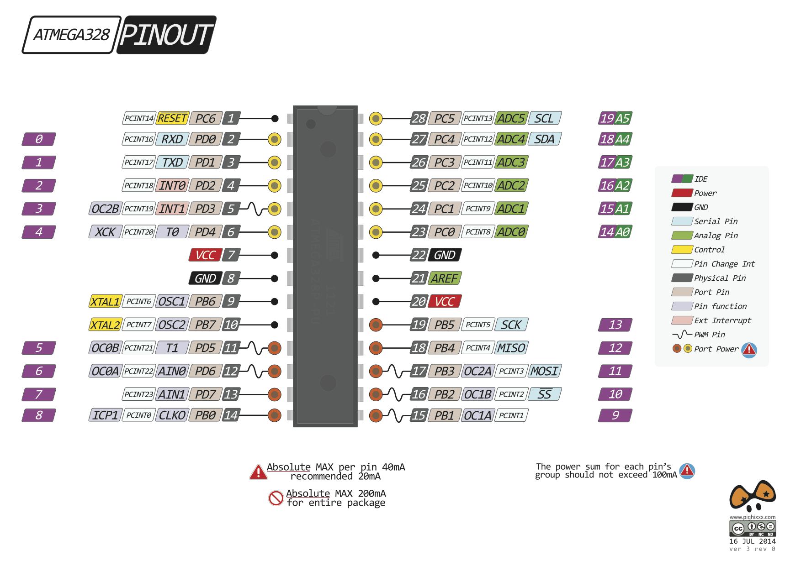
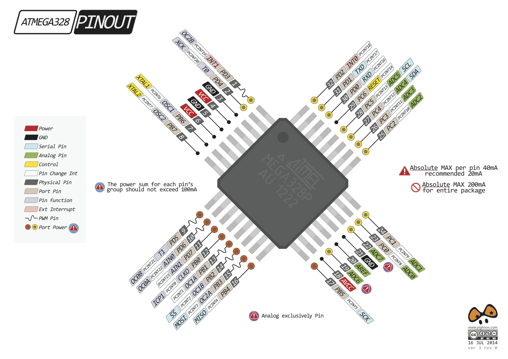
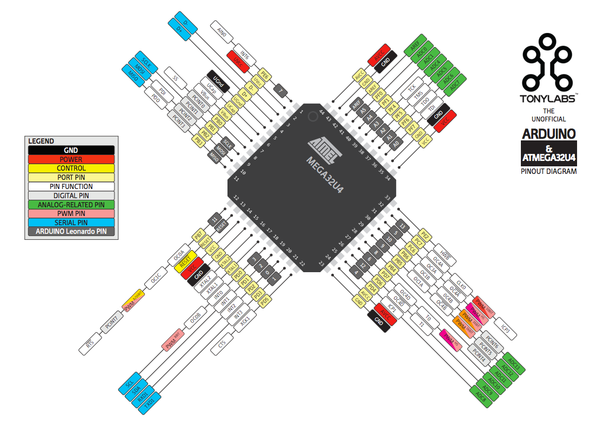
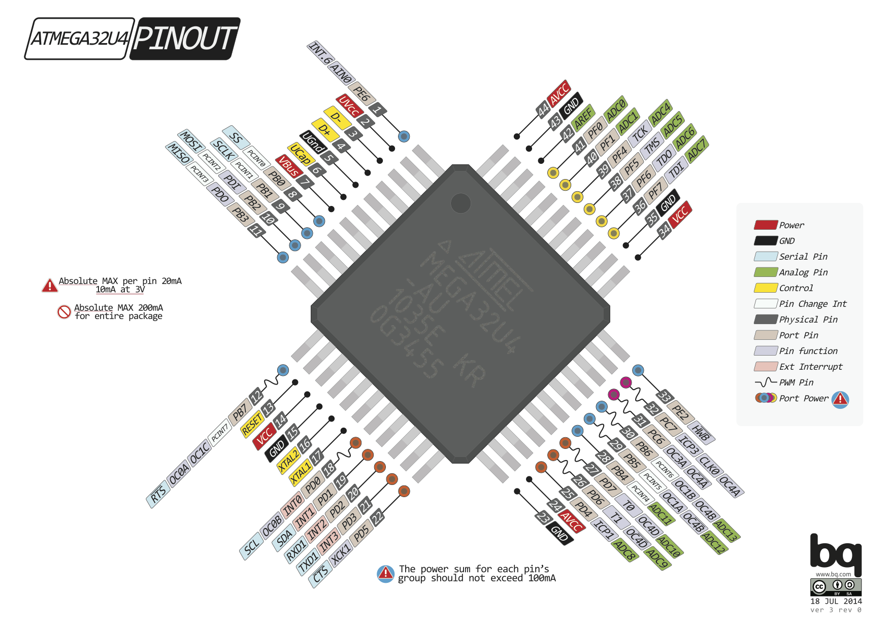
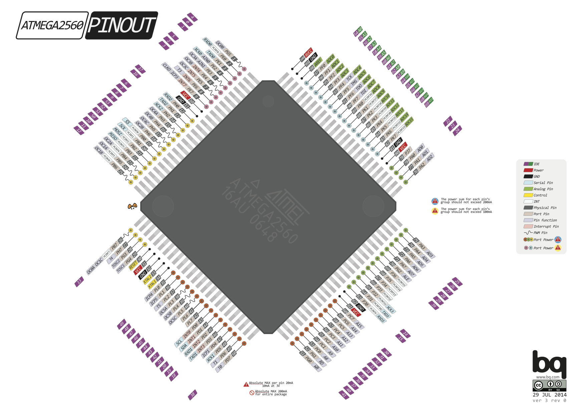
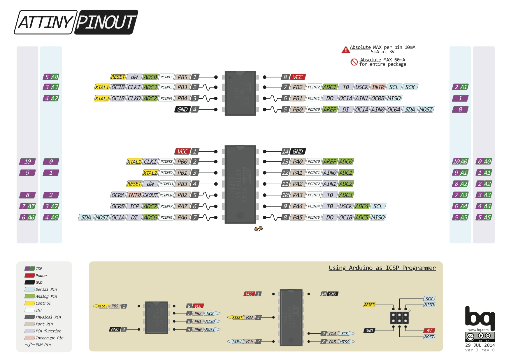
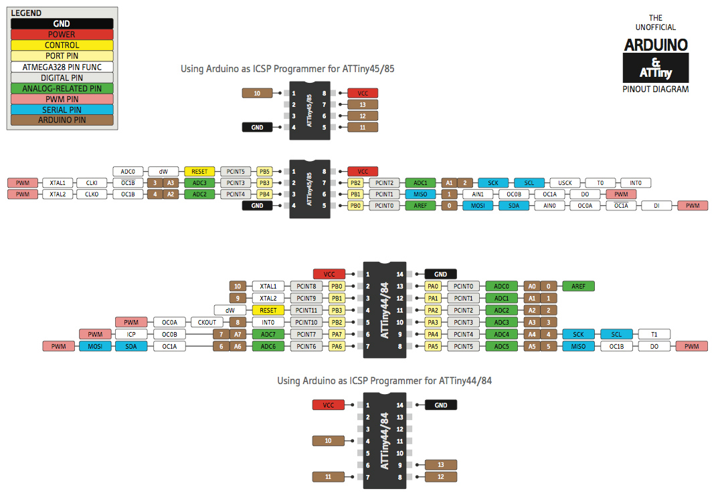

# ATMEGA8-16PI-PIN-OUT

# atmega328w

# ATmEL-MEGA328P-Pinout-Diagram

# ATMEL-MEGA328P-AU-Pin-Out-Diagram

# atmel-atmega32u4-pinout-diagram

# ATMEL-MEGA32U4-AU-Pinout-Diagram

#### ATMEGA-2560-Pin-Out-Diagram (*看不清楚，右键在新标签中打开图片，点击放大*)

# ATINY-PinOut-Diagram

# attiny44_84-attiny45_85-pinout-Diagram

